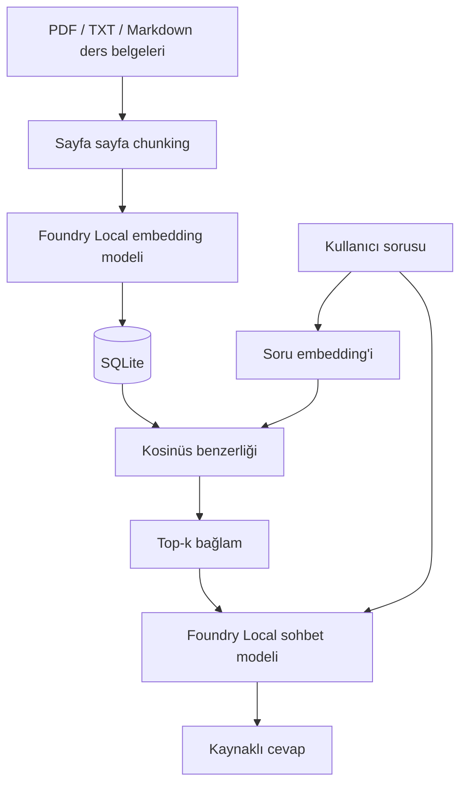

# Ders Çalışma Asistanı

Microsoft Foundry Local, RAG ve SQLite kullanarak tamamen cihaz üzerinde çalışan
bir ders notu soru-cevap uygulaması. Ders PDF'leri, slaytları veya notları küçük
bölümlere ayrılır, her bölümün embedding vektörü üretilir, SQLite'a kaydedilir ve
öğrencinin sorduğu soruda en ilgili bölümler bulunarak yerel dil modeline bağlam
olarak verilir.

## Özellikler

- İnternet gerektirmeyen yerel model çıkarımı
- `.pdf`, `.txt` ve `.md` ders belgeleri için otomatik chunking
- PDF'lerde sayfa numarası takibi ("sayfa 7'de..." gibi kaynak gösterimi)
- Streamlit arayüzünden doğrudan dosya yükleme (PDF/txt/md), dosya listesi ve silme
- Sohbet geçmişi; kaynaklar "dosya.pdf, s. 7" sekmeleri ve alıntı kutularıyla gösterilir
- Embedding vektörlerinin SQLite'ta kalıcı saklanması
- Kosinüs benzerliğiyle top-k retrieval
- Yetersiz bağlamda cevap vermeyi reddetme
- Kaynak adı, sayfa/bölüm numarası ve benzerlik puanı
- CLI ve Streamlit arayüzü
- Foundry modeli olmadan çalışan birim testleri

## Gereksinimler

- Windows 10/11
- Python 3.11 veya üzeri
- VS Code ve Microsoft Python eklentisi
- İlk model indirmesi için internet; sonraki kullanımlar çevrimdışı olabilir
- En az 8 GB RAM (model seçimine göre daha fazlası yararlı olur)

## Windows kurulumu

PowerShell'de proje klasörünü açın:

```powershell
py -3.11 -m venv .venv
.\.venv\Scripts\Activate.ps1
python -m pip install --upgrade pip
pip install -e ".[windows,ui,dev]"
```

PowerShell betik çalıştırmayı engellerse yalnızca mevcut kullanıcı için:

```powershell
Set-ExecutionPolicy -Scope CurrentUser RemoteSigned
```

## Çalıştırma

Ders PDF'lerinizi, slaytlarınızı ya da `.txt`/`.md` notlarınızı `documents`
klasörüne koyun (ya da Streamlit arayüzündeki yükleme kutusunu kullanın). Önce
bilgi tabanını oluşturun:

```powershell
python -m local_rag.cli ingest
```

Konsol arayüzü:

```powershell
python -m local_rag.cli chat
```

Web arayüzü:

```powershell
streamlit run app.py
```

Test ve kod kalite kontrolü:

```powershell
pytest -q
ruff check .
```

VS Code'da aynı işlemler `Terminal > Run Task` menüsündeki hazır görevlerle
çalıştırılabilir.

## Mimari



## Klasör yapısı

```text
foundry-local-rag/
├── app.py                    # Streamlit arayüzü (sohbet geçmişi, dosya listesi, kaynak sekmeleri)
├── styles.css                # Arayüz teması (fosforlu kalem)
├── .streamlit/config.toml    # Tema renkleri, kullanım istatistiğini kapatma
├── documents/                # Yerel bilgi kaynağı (ders PDF/txt/md)
├── src/local_rag/
│   ├── chunking.py           # Metin normalizasyonu ve parçalama
│   ├── loaders.py            # .txt/.md/.pdf'den sayfa sayfa metin çıkarma
│   ├── database.py           # SQLite veri erişimi
│   ├── ingestion.py          # Belge -> sayfa -> chunk -> embedding -> DB
│   ├── providers.py          # Foundry Local SDK adaptörü
│   ├── retrieval.py          # Kosinüs benzerliği ve top-k arama
│   ├── service.py            # RAG orkestrasyonu ve güvenli prompt
│   └── cli.py                # Komut satırı arayüzü
└── tests/                    # Model gerektirmeyen birim testleri
```

## Tasarım kararları

Embedding vektörleri JSON olarak SQLite'ta tutulur. Bu, küçük eğitim veri
kümelerinde kurulumu basit ve gözlemlenebilir yapar. Arama sırasında vektörler
Python'a alınır ve brute-force kosinüs benzerliği hesaplanır. Büyük veri
kümelerinde bu yaklaşım yerine özel bir vektör indeksi gerekir.

Foundry Local erişimi `FoundryLocalRuntime` sınıfında izole edilmiştir. İş mantığı
SDK'ya doğrudan bağımlı olmadığı için sahte sağlayıcılarla hızlı test edilir.
`RagService`, retrieval sonucu eşik altında kaldığında dil modelini hiç çağırmaz.
Bu hem uydurma cevap riskini hem gereksiz hesaplamayı azaltır.

## Sınırlamalar ve geliştirme fikirleri

- `.pdf`, `.txt` ve `.md` desteklenir; DOCX/PPTX henüz yok.
- Taranmış (görüntü tabanlı, metin katmanı olmayan) PDF'lerde OCR yapılmaz; `page.extract_text()` boş dönerse o sayfa atlanır.
- SQLite içinde yaklaşık en yakın komşu indeksi yoktur; veri büyüdükçe arama yavaşlar.
- Chunking karakter tabanlıdır; tokenizer tabanlı parçalama daha hassas olabilir.
- Değerlendirme için precision@k, recall@k ve cevap doğruluğu metrikleri eklenebilir.
- Sohbet geçmişi ve çok turlu soru yeniden yazımı eklenebilir.

## Resmî kaynaklar

- [Foundry Local RAG öğreticisi](https://learn.microsoft.com/azure/foundry-local/tutorials/tutorial-build-rag-app)
- [Foundry Local embedding kullanımı](https://learn.microsoft.com/azure/foundry-local/how-to/how-to-generate-embeddings)
- [Foundry Local SDK referansı](https://learn.microsoft.com/azure/foundry-local/reference/reference-sdk-current)

